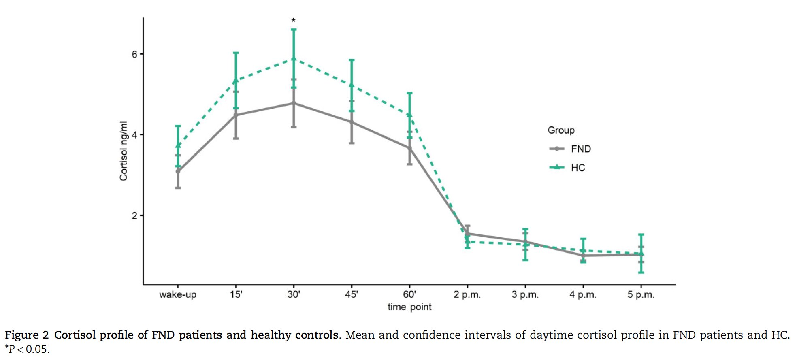
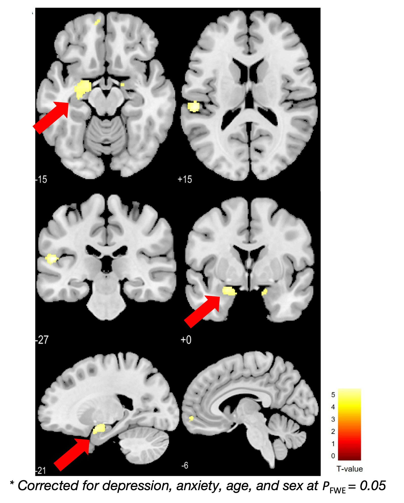

```{r load_data, include=FALSE, message=FALSE, echo = FALSE, warning=FALSE}

#Load packages: 
#Set path for outputfiles
setwd("/Volumes/T7_Samantha/Analyses/Longitudinal/Saliva") #Mac
#setwd("D:\\Analyses\\Longitudinal\\Saliva") #Windows

library(lmerTest) #for Mixed Effect Models
library(MuMIn) #for Mixed Effect Models (R-squared)
library(tidyverse) #for tidying dataframes
library(dplyr) #for proportions tables
library(readxl) #for reading exel-files
library(xlsx) #for saving exel-files
library(ggplot2) #building plots
library(RColorBrewer) #colors for ggplot
library(wesanderson) #colors for ggplot
library(ggpubr) #for histogram
library(gg.gap) #for a break in the y-axis
library(forcats) #for rearanging in ggplot
library(gridGraphics) #for saving gghistogram
library(cowplot) #for adding several plots into one plot
library(plyr) #for descriptive data
library(plotly) #for interactive web graphics
library(xlsx) #to read, write and format excel-files
library(rstatix) #provides pipe-friendly R functions for easy statistical analyses
library(reshape2) #for transforming a dataset from long to wide
library(maditr) #for dcast function
library(writexl)# To write dataframe as excel file
library(car) # Levene's test with one independent variable
library(lawstat)
library(lme4)
library(multcomp)
library(dplyr)
library(tidyr) # to reshape dataframe
library(gridExtra)
library(Gmisc)

#Set path for outputfiles
setwd("/Volumes/T7_Samantha/Analyses/Longitudinal/Saliva") #Mac
#setwd("D:\\Analyses\\Longitudinal\\Saliva") #Windows

#Load data
Data.SCD <- read_xlsx("/Volumes/T7_Samantha/Analyses/Longitudinal/Saliva/Cortisol_BioGen_Cov_FUP.xlsx")
#Data.SCD <- read_xlsx("D:/Analyses/Longitudinal/Saliva/Cortisol_BioGen_Cov_FUP.xlsx")
Data.SCD$Session<-as.factor(Data.SCD$Session)
names(Data.SCD)[names(Data.SCD) == "Cortisol ng/ml"] <- "Cortisol"
Data.SCD$Session <- factor(Data.SCD$Session, levels = rev(levels(Data.SCD$Session)))
```

We collected nine saliva samples throughout the day: Five samples were taken in the morning in order to assess the **Cortisol Awakening Response (CAR)** and four samples were taken in the afternoon in order to assess the **Diurnal Baseline Cortisol (DBC)** levels. After 8 months, a follow-up measurement was conducted, repeating all the measures as at t1. We previously identified a flattened CAR in patients with functional neurological disorders (FND) in comparison to healthy controls (HC).

The exact procedure of the saliva sampling can be found here: [Weber - 2022 - Identification of biopsychologial trait markers in functional neurological disorders](https://academic.oup.com/brain/advance-article/doi/10.1093/brain/awac442/6843677?login=false)

# Introduction

In the previous work, we could show that FND patients have a flatter cortisol awakening response (CAR) compared to healthy controls (HC), Figure 1.

{width="478"}

Also, we could show that the reduced CAR was associated not only with severity but also duration of past emotional neglect (Figure 2).

**This suggests some sort of long-term maladaptive habituation of the HPA-axis in FND as a response to prolonged emotional stress/neglect!**

{width="520"}

Additionally, we could show that FND patients had a significantly reduced hippocampal (and amygdalar) volume (Figure 3).

{width="339"}

In healthy controls, we found that higher cortisol levels were associated with smaller brain volumes. This would support a neurotoxicity hypothesis. Due to the absence of such an association in FND, we suggest that **reduced hippocampal volume potentially represents a biological vulnerability factor for FND** in the form of a stress-diathesis model, which refers to having a predisposition to a condition which might be activated through stress.

## Study design and aim of the current project

Based on previous results, we aim at investigating the natural course of FND. As such, 53 FND patients participated in a follow-up measurement. At both timepoints (T1 and follow-up(FUP)), the following measures were done:

<li>Neuroimaging (structural, resting-state fMRI)</li>

<li>Cortisol samples</li>

<li>Questionnaires (general health, mood)</li>

<li>Neurological examination</li>

</br>Only at t1, we assessed the following data:

<li>Genetics/epigenetics of certain genes associated with the stress pathway</li>

<li>Data on menstrual cycle</li>

<li>healthy control cohort</li>

</br>

{width="522"} </br>

# Demographic and Clinical Data

In total, 53 FND patients participated in the follow-up measurement. We can first look at demographic and clinical characteristics.

```{r Demographic table, echo=FALSE, message=FALSE, warning=FALSE}
Data.SCD$gender<-as.factor(Data.SCD$gender)
Data.SCD$smoke<-as.factor(Data.SCD$smoke)
Data.SCD$psychMed<-as.factor(Data.SCD$psychMed)
Data.SCD$menopause<-as.factor(Data.SCD$menopause)
Data.SCD$contraception<-as.factor(Data.SCD$contraception)
Data.SCD$group<-as.factor(Data.SCD$group)

Demo<-dplyr::select(Data.SCD, p_code, Session, group, timepoint, age,gender, bdi, stai1, sfmdrs, sss, sf36_phyfun:sf36_genheal)
Demo<-filter(Demo, timepoint == "wake-up")

Demo.table <- Demo  %>%
  set_column_labels(age = "Age, mean (SD)",
                    gender = "Sex [females]",
                    Session = "Session",
                    bdi = "BDI - Depression, mean (SD)",
                    stai1 = "STAI1 - State Anxiety, mean (SD)",
                    sfmdrs = "S-FMDRS - Symptom Severity, mean (SD)",
                    sss = "Subjective Symptom Severity, mean (SD)")
Demo.table %>% 
  getDescriptionStatsBy(age,
                        gender,
                        bdi,
                        stai1,
                        sfmdrs,
                        sss,
                        by = Session,
                        add_total_col = TRUE,
                        digits = 0,
                        header_count = FALSE,
                        statistics = list(continuous = getPvalAnova, 
                                        factor = getPvalChiSq, 
                                         proportion = getPvalFisher))%>% 
  htmlTable(caption  = "Demographic and clincal characteristics")

```

</br> Patients did not differ in their clinical characteristics from T1 to Follow-up. We can also look at the plots and the individual development.

</br>

```{r Demographic plots, echo=FALSE, message=FALSE, warning=FALSE}
# First we define our questionnaires of interest
QoI = c("bdi","stai1","sfmdrs", "sss","sf36_phyfun","sf36_emoprob","sf36_phyhealth","sf36_energy_fatigue","sf36_mentalhealth",
        "sf36_socfunct","sf36_pain", "sf36_genheal")# "pss", ctq_emoab","ctq_physab","ctq_sexab","ctq_emoneg", "ctq_physneg","ctq_minim") # questionnaires of interst

## Define plotting function
plotBoxplotGroups <- function(df, var , tit ){ 
  plot <-ggplot(df, aes(x=Session, y=var, fill=Session)) + # this is just the ground structure. We have timpoint on x axis, our KIMS score on y, and we want to seperate the groups. 
    geom_boxplot(show.legend = FALSE)+ # here we say what kind of plot we want to make
    labs(y = "Score") + # These are just the different titles
    theme_classic()+ # here we have the background, simple white :)
    scale_fill_manual(values = c("#868686FF", "#2BB08E"))+ # these are the colours of inselspital. You can google HEX codes and find your own colours. 
    scale_x_discrete(labels=c("T1", "Follow-up"))+  # these are our labels for the x axis
    #guides(fill=guide_legend(title="Timepoint"))+ # and a title for our legend
    ggtitle(tit) +
    xlab("")
  
  return(plot)
}

## Define plotting function
plotLineplotGroups <- function(df, var , tit ){ 
  plot <- df %>%
    ggplot( aes(x=Session, y=var, group=p_code)) +
    geom_line() + 
    labs(y = "Score")+
    stat_smooth(aes(group = 1)) +
    stat_summary(aes(group = 1), geom = "point", fun = median, shape = 17, size = 3) +
    theme_pubclean()+
    ggtitle(tit) +
    xlab("")
  
  return(plot)
}

## Define plotting function
plotBoxplotGroupsSession <- function(df, var , tit ){ 
  plot <-ggplot(df, aes(x=Session, y=var, fill=group)) + # this is just the ground structure. We have timpoint on x axis, our KIMS score on y, and we want to seperate the groups. 
    geom_boxplot(show.legend = TRUE, add = "jitter")+ # here we say what kind of plot we want to make
    labs(y = "Value") + # These are just the different titles
    theme_classic()+ # here we have the background, simple white :)
    scale_fill_manual(values = c("#868686FF", "#2BB08E"))+ # these are the colours of inselspital. You can google HEX codes and find your own colours. 
    scale_x_discrete(labels=c("T1", "Follow-up"))+  # these are our labels for the x axis
    #guides(fill=guide_legend(title="Timepoint"))+ # and a title for our legend
    ggtitle(tit) +
    xlab("")
  
  return(plot)
}


p1 <- plotBoxplotGroups(Demo,Demo$bdi,"BDI - Depression")+ ylim(0,75)+ stat_compare_means(method = "anova", paired = TRUE, label.x = 1.3, label.y = 65)
p2 <- plotBoxplotGroups(Demo,Demo$stai1,"STAI1 - State Anxiety")+ ylim(0,85)+ stat_compare_means(method = "anova", paired = TRUE, label.x = 1.3, label.y = 75)
p3 <- plotBoxplotGroups(Demo,Demo$sfmdrs,"S-FMDRS - Symptom Severity")+ ylim(0,65)+ stat_compare_means(method = "anova", paired = TRUE, label.x = 1.3, label.y = 55)
p4 <- plotBoxplotGroups(Demo,Demo$sss,"Subjective Symptom Severity") + ylim(0,110)+ stat_compare_means(method = "anova", paired = TRUE, label.x = 1.3, label.y = 105)

figureClinicalBox <- ggarrange(p1,p2,p3,p4,
                    ncol = 2, nrow = 2)
figureClinicalBox

# Let's check the individuals
p1 <- plotLineplotGroups(Demo,Demo$bdi,"BDI - Depression")
p2 <- plotLineplotGroups(Demo,Demo$stai1,"STAI1 - State Anxiety")
p3 <- plotLineplotGroups(Demo,Demo$sfmdrs,"S-FMDRS - Symptom Severity")
p4 <- plotLineplotGroups(Demo,Demo$sss,"Subjective Symptom Severity") 

figureClinicalLine <- ggarrange(p1,p2,p3,p4,
                               ncol = 2, nrow = 2)
figureClinicalLine

rm(Demo.table, p1, p2, p3, p4, QoI, figureClinicalBox, figureClinicalLine)
```

</br>

# Cortisol in FND

Previously, we analysed two metrics to assess cortisol levels: the **cortisol awakening response (CAR)** and the **diurnal baseline cortisol (DBC)**. The CAR describes the rapid increase in cortisol secretion across the first 30--45 min upon awakening. To assess cortisol differences between T1 and Follow-up in the CAR, a repeated-measures ANOVA was used on the fitted data of the five morning samples (wake-up until 60 min post-awakening) using a linear mixed model with fixed effects of factor Session (T1 vs. FUP) and time point, and using age, sex, **symptom severity**, smoking, hormonal contraception, psychotropic medication, and menopause as covariates of no interest. </br>The DBC represents the dynamic changes of cortisol throughout the afternoon (from 2 p.m. to 5 p.m.). As previously, no changes in DBC were found, I did not analyse DBC in the longitudinal data. </br>For the analyses of the CAR, I excluded data from one FND patients it did not properly adhere to the saliva sampling protocol (delayed sampling with a strict sampling accuracy margin of Δt \> 5 min for post-awakening samples). </br>

First we visualize our data.</br>

## Cortisol: Visualization

```{r Data Visualization Cortisol, echo=FALSE, message=FALSE, warning=FALSE}
# plot whole day
plot1<-ggline(Data.SCD, x = "timepoint", y = "Cortisol",linetype = "Session", shape = "Session", point.size = 0.5,
             add = c("mean_se"), #add jitter if you want to see all the dots
             color = "Session", palette = c("#868686FF", "#2BB08E"), size = 1)
plot1<-ggpar(plot1, font.legend = 9, font.tickslab = 9, font.x = 9, font.y = 9)+ theme(legend.position = c(0.8, 0.5))+
    ggtitle("Cortisol Profile in FND Patients at T1 and FUP") 

plot1
# Take only morning samples
CAR<-filter(Data.SCD, timepoint == "wake-up" |timepoint == "15'" | timepoint == "30'" | timepoint == "45'" | timepoint == "60'")

# plot it
plot2<-ggline(CAR, x = "timepoint", y = "Cortisol",linetype = "Session", shape = "Session", point.size = 0.5,
                add = c("mean_se"), #add jitter if you want to see all the dots
                color = "Session", palette = c("#868686FF", "#2BB08E"), size = 1)
plot2<-ggpar(plot2, font.legend = 9, font.tickslab = 9, font.x = 9, font.y = 9)+ theme(legend.position = c(0.9, 0.8))+
    ggtitle("Cortisol Awakening Response in FND Patients at T1 and FUP") 

plot2


```

</br>We can already see that the values are relatively stable (at FUP in comparison to T1). Next we run the statistics. </br>

## Cortisol: Statistics

In our model, we can see that there is **no** significant effect of Session - no differences in cortisol between T1 and FUP. However, there seems to be a significant effect of **symptom severity (S-FMDRS)** on the cortisol. </br></br>

<mark> **There is a significant association between changes in symptom severity and changes in cortisol.** </mark></br> </br> Visually and statistically, we cannot detect any differences between the measurement timepoints, nor any interactione effects between Session (t1 vs. follow-up) and symptom severity (sfmdrs). </br></br> This means: </br>

<li>**No significant effect of Session:** Patients do not differ between T1 and FUP regarding their CAR levels</li>

<li>**No significant interaction effect:** Patients who improved/worsened in symptom severity did not change in their cortisol levels</li>

<li>**Significant effect of timepoint:** This is expected, as the CAR increases and decreases over time</li>

</br>

So, how exactly are changes in symptom severity associated with the (non-visible) changes in the CAR without a (session) interaction effect?</br>

```{r Data Analysis Cortisol, echo=FALSE, message=FALSE, warning=FALSE}
# Find non-adherers
Exclude <- filter(CAR, delay > 5) # if delay is > 5 min
# These are: [1] "312"
# Then we remove
CAR<- subset(CAR, CAR$p_code != "312") 

## Linear Mixed Model (Cortisol Awakening Response)
CARlm <- lm(formula = Cortisol ~ timepoint + Session*sfmdrs + DurationSymptoms + gender + smoke+ psychMed + menopause + 
              contraception + age, data = CAR)

#summary(CARlm) # to check effects
CARAov <- aov(CARlm)
summary(CARAov)

rm(plot1, plot2, Exclude, CARAov, CARlm)

```

</br>

### Delta Scores

In order to reduce the dimensionality of our data, we can calculate delta scores, i.e., subtracting t1 from fup data. This will reduce our model by one full factor (Session). </br> We again plot our data, and run a repeated-measures ANOVA was used on the fitted data of the five morning samples (wake-up until 60 min post-awakening) using a linear mixed model with fixed effects of time point, and using age, sex, **symptom severity**, smoking, hormonal contraception, psychotropic medication, and menopause as covariates of no interest. </br>(Caveat: Factor Session is removed, as we work with Delta Scores) </br> </br>

We again detect a significant effect of symptom severity. This confirms: **A change in symptom severity is associated with a change in CAR**. </br>

```{r Data Analysis Delta Cortisol, echo=FALSE, message=FALSE, warning=FALSE}

# In order to reduce the dimensionality of our model, we can calculate delta scores 
# of the cortisol, for which we just subtract the t1 from fup 

deltaCort <- CAR$Cortisol[CAR$Session=="fup"] - CAR$Cortisol[CAR$Session=="t1"]
deltaSFMDRS <- CAR$sfmdrs[CAR$Session=="fup"] - CAR$sfmdrs[CAR$Session=="t1"] # positive delta score = worse, negative delta score = improved
deltaBDI <- CAR$bdi[CAR$Session=="fup"] - CAR$bdi[CAR$Session=="t1"]
deltaSTAI <- CAR$stai1[CAR$Session=="fup"] - CAR$stai1[CAR$Session=="t1"]
gender <- CAR$gender[CAR$Session =="t1"]
smoke <- CAR$smoke[CAR$Session =="t1"]
psychMed <-CAR$psychMed[CAR$Session == "t1"]
contraception <- CAR$contraception[CAR$Session =="t1"]
age <- CAR$age[CAR$Session =="t1"]
timepoint<- CAR$timepoint[CAR$Session == "t1"]
p_code<- CAR$p_code[CAR$Session == "t1"]

#with Covariate
summary(aov(lm(deltaCort~timepoint*deltaSFMDRS+deltaBDI+deltaSTAI+gender+smoke+contraception+age+psychMed)))
# Report: A significant  effect of Symptom Severity was found for the DeltaCAR (F(1,250) = 7.445, P = 0.006). 
# A positive CAR (= fup higher than t1) is associated with a negative SFMDRS (= FUP lower than T1)

```

## Stratification based on clinical course at FUP (S-FMDRS)

In order to disentangle the effect of symptom severity on the CAR, we stratify our patients into subgroups based on the S-FMDRS score. As such, we created a delta-score by subtracting the t1 score from the fup score. </br>This leaves us with: </br>

<li>**Positive Delta SFMDRS Score:** Patient got worse</li>

<li>**No change in Delta SFMDRS Score:** Patient did not improve, nor worsen</li>

<li>**Negative Delta SFMDRS Score:** Patient improved.</li>

</br></br>We now look at patients who improved in comparison to those who remained or worsened in their symptom severity. </br>

```{r Plot according to SFMDRS, echo=FALSE, message=FALSE, warning=FALSE}
Demo<-Demo%>%
  mutate(group = factor(group, labels = c("improved", "worsened/remained")))

# Let's check the individuals
sfmdrsplot <- Demo %>%
  ggplot( aes(x=Session, y=sfmdrs, group=p_code, col = group)) +
  geom_line(aes(col = group)) + 
  labs(y = "Score", x = "timepoint")+
  stat_smooth(aes(group = 1)) +
  stat_summary(aes(group = 1), geom = "point", fun = mean, shape = 17, size = 3) +
  scale_color_manual(values = c("#868686FF", "#2BB08E"))+
  theme_pubclean()+
  ggtitle("Evolution S-FMDRS")


  sfmdrsbox <-ggplot(Demo, aes(x=Session, y=sfmdrs, fill=group)) + 
    geom_boxplot(show.legend = TRUE, add = "jitter")+ # here we say what kind of plot we want to make
    labs(y = "Score") + # These are just the different titles
    theme_classic()+ # here we have the background, simple white :)
    scale_fill_manual(values = c("#868686FF", "#2BB08E"))+ # these are the colours of inselspital. You can google HEX codes and find your own colours. 
    scale_x_discrete(labels=c("T1", "Follow-up"))+  # these are our labels for the x axis
    #guides(fill=guide_legend(title="Timepoint"))+ # and a title for our legend
    ggtitle("Evolution S-FMDRS") +
    xlab("")
sfmdrsplot
sfmdrsbox

```

</br> It seems that patients that improved had generally a lower S-FMDRS score as patients that remained or worsened. Using the ANOVA (Chapter 2), we did not detect any differences in symptom severity between time points. Let's do baseline and FUP comparisons, as well as another ANOVA with another factor (clinical course). </br></br>

**Statistical test**</br> We detect a significant effect of group (F(1,950) = 7.51, P = 0.006), as well as a significant interaction effect between group and session (F(1,950) = 25.09, P \> 0.0001). </br> This means that: </br>

<li>Patients who were initially (t1) high in symptom severity improved for fup</li>

<li>Patients who were initially (t1) low(er) got worse at fup.</li>

```{r Table according to SFMDRS, echo=FALSE, message=FALSE, warning=FALSE}

Data.Symptom<-dplyr::select(Data.SCD, p_code, Session, group, timepoint, age,gender, bdi, stai1, sfmdrs, sss, sf36_phyfun:sf36_genheal)
Data.Symptom$group<-as.factor(revalue(Data.Symptom$group, c("same_worse"="worse")))
Data.Symptom$groups<-interaction(Data.Symptom$group, Data.Symptom$Session)

# Compute the analysis of variance
res.aov <- aov(sfmdrs ~ Session*group, data = Data.Symptom)
# Summary of the analysis
summary(res.aov) #there is no change in SFMDRS between t1 and fup
#Wir vergleichen jetzt die verschiedenen Gruppen und Zeitpunkte
model_posthoc<-with(Data.Symptom, glm(sfmdrs ~ groups + bdi + stai1, family=gaussian)) #wir fügen die gleichen Covariaten wie oben ein
summary(glht(model_posthoc, 
             linfct = mcp(groups=
                            #Is the difference between these groups between the different timepoints? can be corrected for multiple comparisons.
                            c("(worse.fup)-(worse.t1)=0", 
                              "(improved.fup)-(improved.t1)=0", 
                              "(worse.fup)-(improved.fup)=0", 
                              "(worse.t1)-(improved.t1)=0",
                              "((worse.fup)-(worse.t1)) - ((improved.fup)-(improved.t1))=0"))),
        test = adjusted("none")) 

Data.T1<- filter(Data.SCD, timepoint == "wake-up", Session == "t1") # we only need one value per sfmdrs/session
Symptom.table <- Data.T1   %>%
  mutate(group = factor(group, labels = c("improved", "worsened/remained")))%>% 
  set_column_labels(group = "Clinical course",
                    age = "Age, mean (SD)",
                    gender = "Sex [females]",
                    bdi = "BDI - Depression, mean (SD)",
                    stai1 = "STAI1 - State Anxiety, mean (SD)",
                    sfmdrs = "S-FMDRS - Symptom Severity, mean (SD)",
                    sss = "Subjective Symptom Severity, mean (SD)")
Symptom.table %>% 
  getDescriptionStatsBy(age,
                        gender,
                        bdi,
                        stai1,
                        sfmdrs,
                        sss,
                        by = group,
                        add_total_col = TRUE,
                        digits = 0,
                        header_count = FALSE,
                        statistics = list(continuous = getPvalAnova, 
                                          factor = getPvalChiSq, 
                                          proportion = getPvalFisher))%>% 
  htmlTable(caption  = "Patient characteristics at T1, based on later clinical improvement")

Data.T2<- filter(Data.SCD, timepoint == "wake-up", Session == "fup") # we only need one value per sfmdrs/session
Symptom.table <- Data.T2   %>%
  mutate(group = factor(group, labels = c("improved", "worsened/remained")))%>% 
  set_column_labels(group = "Clinical course",
                    age = "Age, mean (SD)",
                    gender = "Sex [females]",
                    bdi = "BDI - Depression, mean (SD)",
                    stai1 = "STAI1 - State Anxiety, mean (SD)",
                    sfmdrs = "S-FMDRS - Symptom Severity, mean (SD)",
                    sss = "Subjective Symptom Severity, mean (SD)")
Symptom.table %>% 
  getDescriptionStatsBy(age,
                        gender,
                        bdi,
                        stai1,
                        sfmdrs,
                        sss,
                        by = group,
                        add_total_col = TRUE,
                        digits = 0,
                        header_count = FALSE,
                        statistics = list(continuous = getPvalAnova, 
                                          factor = getPvalChiSq, 
                                          proportion = getPvalFisher))%>% 
  htmlTable(caption  = "Patient characteristics based on clinical improvement at FUP")

rm(CAR, Data.T1, Data.T2, model_posthoc, sfmdrsbox, sfmdrsplot, Symptom.table)
```

### Stratification based on other clinical scores

For completedness, we can also look at differences in BDI and STAI.

**Statistical test**</br>

```{r Table according to other clinical scores, echo=FALSE, message=FALSE, warning=FALSE}

# Compute the analysis of variance
paste("Results BDI:")
res.aov <- aov(bdi ~ Session*group, data = Data.Symptom)
# Summary of the analysis
summary(res.aov) #there is no change in SFMDRS between t1 and fup
model_posthoc<-with(Data.Symptom, glm(bdi ~ groups + stai1 + sfmdrs, family=gaussian)) #wir fügen die gleichen Covariaten wie oben ein

#Wir vergleichen jetzt die verschiedenen Gruppen und Zeitpunkte
summary(glht(model_posthoc, 
             linfct = mcp(groups=
                            #Is the difference between these groups between the different timepoints? can be corrected for multiple comparisons.
                            c("(worse.fup)-(worse.t1)=0", 
                              "(improved.fup)-(improved.t1)=0", 
                              "(worse.fup)-(improved.fup)=0", 
                              "(worse.t1)-(improved.t1)=0",
                              "((worse.fup)-(worse.t1)) - ((improved.fup)-(improved.t1))=0"))),
        test = adjusted("none")) 

plotBoxplotGroupsSession(Demo,Demo$bdi,"Evolution BDI")


# Compute the analysis of variance
paste("Results STAI-1:")
res.aov <- aov(stai1 ~ Session*group, data = Data.Symptom)
# Summary of the analysis
summary(res.aov) #there is no change in SFMDRS between t1 and fup
model_posthoc<-with(Data.Symptom, glm(stai1 ~ groups + bdi + sfmdrs, family=gaussian)) #wir fügen die gleichen Covariaten wie oben ein

#Wir vergleichen jetzt die verschiedenen Gruppen und Zeitpunkte
summary(glht(model_posthoc, 
             linfct = mcp(groups=
                            #Is the difference between these groups between the different timepoints? can be corrected for multiple comparisons.
                            c("(worse.fup)-(worse.t1)=0", 
                              "(improved.fup)-(improved.t1)=0", 
                              "(worse.fup)-(improved.fup)=0", 
                              "(worse.t1)-(improved.t1)=0",
                              "((worse.fup)-(worse.t1)) - ((improved.fup)-(improved.t1))=0"))),
        test = adjusted("none")) 

plotBoxplotGroupsSession(Demo,Demo$stai1,"Evolution STAI-I")

rm(model_psthoc, res.aov)
```

We can indeed observe a very interesting behaviour. </br>

<li>**BDI:** Patients who improved in their symptom severity did not improve in their BDI, while patients who worsened/remained improved in their BDI.</li>

<li>**STAI-1:** Patients who improved in their symptom severity did not improve in their STAI, while patients who worsened/remained worsened also in their STAI-1</li>

</br></br> What does this tell us about the CAR?

## Temporal shift in CAR

Next, we stratify our CAR data based on clinical course after 8 months. We can see that improvement of the symptoms is associated with a **temporal shift in the CAR**. </br>

```{r CAR Shift, echo=FALSE, message=FALSE, warning=FALSE}

# VISUALISATION AND STATS CAR --------------------------------------------------
# plot follow up data, stratified into groups (improved, not improved)
Data.SCD$group<-revalue(Data.SCD$group, c("same_worse"="same/worse"))
# Take only morning samples
CAR.I<-filter(Data.SCD, timepoint == "wake-up" |timepoint == "15'" | timepoint == "30'" | timepoint == "45'" | timepoint == "60'")
CAR.I<- subset(CAR.I, CAR.I$p_code != "312") 

Data.Base<-filter(CAR.I, Session == "t1")
plot<- ggline(Data.Base, x = "timepoint", y = "Cortisol",linetype = "group", shape = "group", point.size = 0.5,
              add = c("mean_se"), # mean and confidence intervall, you can also use mean_se or similar
              color = "group", palette = c("#868686FF","#2BB08E"), size = 1) # Inselspital colours
plot1<-ggpar(plot, font.legend = 9, font.tickslab = 9, font.x = 9, font.y = 9)+ theme(legend.position = c(0.8, 0.9))+ggtitle("CAR at Baseline T1")


Data.I<-filter(CAR.I, Session == "fup")
plot<- ggline(Data.I, x = "timepoint", y = "Cortisol",linetype = "group", shape = "group", point.size = 0.5,
              add = c("mean_se"), # mean and confidence intervall, you can also use mean_se or similar
              color = "group", palette = c("#868686FF","#2BB08E"), size = 1) # Inselspital colours
plot2<-ggpar(plot, font.legend = 9, font.tickslab = 9, font.x = 9, font.y = 9)+ theme(legend.position = c(1.8, 1.9))+ggtitle("CAR at Follow-up")


figureCARshift <- ggarrange(plot1, plot2,
                    ncol = 2, nrow = 1)
figureCARshift

rm(plot, plot1, plot2, model_posthoc, figureCARshift, res.aov)

```

</br> We can look again at our delta scores, and we can see: </br></br>**Patients who improved had**

<li>a higher value at wake-up at FUP, as depicted by a <i>positive</i> delta score</li>

<li>an earlier peak and stronger/faster flattening of the curve at FUP, as depicted by a <i>negative</i> delta score towards the end score</li>

<br>**Patients who worsened/remained had**

<li>a lower value at wake-up at FUP, as depicted by a <i>negative</i> delta score</li>

<li>a later peak (i.e., temporal shift) at FUP, as depicted by a <i>positive</i> delta score towards the end</li>

</br></br> And this, ladies and gentlemen, is our "hidden" effect of symptom severity. </br></br> Why is this particularly interesting? </br></br> <mark>**The CAR gets mostly triggered by the hippocampus and it may be linked to the hippocampus' preparation of the HPA axis in anticipation of metabolic demands and stress.**</mark>

```{r CAR Shift Delta Plot, echo=FALSE, message=FALSE, warning=FALSE}
#Next, we define again our groups, based on delta SFMDRS
group <- as.data.frame(deltaSFMDRS)
threshold = 0
group$deltaSFMDRS[group$deltaSFMDRS < threshold] <- "improved"
group$deltaSFMDRS[!group$deltaSFMDRS == "improved"] <- "same/worsened"
group<-group$deltaSFMDRS

#Make dataframe
Data.D<-as.data.frame(p_code)
Data.D$Cortisol<-deltaCort
Data.D$timepoint <-timepoint
Data.D$sfmdrs<-deltaSFMDRS
Data.D$bdi<-deltaBDI
Data.D$stai<-deltaSTAI
Data.D$gender<-as.factor(gender)
Data.D$smoke <- as.factor(smoke)
Data.D$psychMed <- as.factor(psychMed)
Data.D$contraception <-as.factor(contraception)
Data.D$age<-age
Data.D$group<-as.factor(group)

# Can we plot delta scores?
plot<- ggline(Data.D, x = "timepoint", y = "Cortisol",linetype = "group", shape = "group", point.size = 0.5,
              add = c("mean_se"), # mean and confidence intervall, you can also use mean_se or similar
              color = "group", palette = c("#868686FF","#2BB08E"), size = 1) # Inselspital colours
plot<-ggpar(plot, font.legend = 9, font.tickslab = 9, font.x = 9, font.y = 9)+ theme(legend.position = c(0.9, 0.8))
plot # FUP - T1 --> if value is "higher" , then FUP was higher than T1, when low --> FUP was lower than T1, that means that in those that did not improve
# improved: increase at follow up their wake up with respect to t1
# same: decrease/remained at follow up their wake up with respect to t1
# same: had a delay and increased response in 30-60' samples. 

#HPA axis gets triggered by Hippocampus - wikipedia --> CAR absent in those 
#rm(plot, age , contraception, group, deltaBDI, deltaSTAI, deltaCort, timepoint, deltaSFMDRS, gender, smoke, psychMed, threshold, p_code)


paste("We play around with another threshold for symptom severity:")
#Next, we define again our groups, based on delta SFMDRS
group <- as.data.frame(deltaSFMDRS)
threshold = 5
group$deltaSFMDRS[group$deltaSFMDRS < threshold] <- "improved"
group$deltaSFMDRS[!group$deltaSFMDRS == "improved"] <- "same/worsened"
group<-group$deltaSFMDRS
#Make dataframe
Data.SS<-as.data.frame(p_code)
Data.SS$group<-as.factor(group)
## Test with new threshold
  Data.Th <- left_join(x=Data.SCD, y=Data.SS, by.x = c("p_code","Session"), by.y = c("p_code", "Session"))

# Take only morning samples
CAR.I<-filter(Data.Th, timepoint == "wake-up" |timepoint == "15'" | timepoint == "30'" | timepoint == "45'" | timepoint == "60'")
CAR.I<- subset(CAR.I, CAR.I$p_code != "312") 

Data.Base<-filter(CAR.I, Session == "t1")
plot<- ggline(Data.Base, x = "timepoint", y = "Cortisol",linetype = "group", shape = "group", point.size = 0.5,
              add = c("mean_se"), # mean and confidence intervall, you can also use mean_se or similar
              color = "group", palette = c("#868686FF","#2BB08E"), size = 1) # Inselspital colours
plot1<-ggpar(plot, font.legend = 9, font.tickslab = 9, font.x = 9, font.y = 9)+ theme(legend.position = c(0.8, 0.9))+ggtitle("CAR at Baseline T1")


Data.I<-filter(CAR.I, Session == "fup")
plot<- ggline(Data.I, x = "timepoint", y = "Cortisol",linetype = "group", shape = "group", point.size = 0.5,
              add = c("mean_se"), # mean and confidence intervall, you can also use mean_se or similar
              color = "group", palette = c("#868686FF","#2BB08E"), size = 1) # Inselspital colours
plot2<-ggpar(plot, font.legend = 9, font.tickslab = 9, font.x = 9, font.y = 9)+ theme(legend.position = c(1.8, 1.9))+ggtitle("CAR at Follow-up")


figureCARshift <- ggarrange(plot1, plot2,
                    ncol = 2, nrow = 1)
figureCARshift

rm(plot, plot1, plot2, model_posthoc, figureCARshift, res.aov)

table(Data.I$group[timepoint == 'wake-up'])


```

</br> As a next step, we look at the statistics of the delta scores, and run post-hoc analyses on the individual timepoints to confirm that they significantly differ depending on clinical course. The post-hoc analyses might uncover the interaction, which cannot be found in the previous tests.</br></br> <mark>**Indeed: An improvement in symptom severity is associated with with a temporal shift in the CAR.**</mark>

```{r CAR Shift Delta Stats, echo=FALSE, message=FALSE, warning=FALSE}

Data.D$time_points<-as.factor(revalue(Data.D$timepoint, c("wake-up"="1","15'" ="2", "30'"="3", "45'"="4", "60'"="5")))
Data.D$group<-as.factor(revalue(Data.D$group, c("same/worsened"="worse")))

#with Covariate
#summary(aov(lm(Cortisol~group*timepoint + sfmdrs +bdi+contraception+age+psychMed, data = Data.D)))
# Report: A significant  effect of Symptom Severity was found for the DeltaCAR (F(1,250) = 7.445, P = 0.006). 
# A positive CAR (= fup higher than t1) is associated with a negative SFMDRS (= FUP lower than T1)

Data.D$groups<-interaction(Data.D$group, Data.D$time_points)

model_posthoc<-with(Data.D, lm(sfmdrs ~ Cortisol*groups+bdi+contraception+age+psychMed, family=gaussian))
summary(glht(model_posthoc, 
             linfct = mcp(groups=c("(worse.1)-(improved.1)=0",
                              "(worse.2)-(improved.2)=0",
                              "(worse.3)-(improved.3)=0",
                              "(worse.4)-(improved.4)=0",
                              "(worse.5)-(improved.5)=0"))),test = adjusted("none")) #1 to 5 corresponds to different sampling timepoints

rm(model_posthoc)
```

## Cortisol Amplitude

This analyses was suggested by Fabian. Basically, he said it could be interesting to look at the amplitude of cortisol throughout the day. So we basically calculate the amplitude (height) between the lowest and the highest peak of the cortisol within one day. 

```{r Cortisol Amplitude, echo=FALSE, message=FALSE, warning=FALSE}

# First, we have to find max and min value per subject per Session. This requires some reformulation. 
Data.AT1<-filter(Data.SCD, Session == "t1")
Data.AFUP<-filter(Data.SCD, Session == "fup")
Data.AT1<-dplyr::select(Data.AT1, p_code, Cortisol, timepoint, age, gender, smoke, psychMed, DurationSymptoms, menopause, contraception)
Data.AFUP<-dplyr::select(Data.AFUP, p_code, Cortisol, timepoint, age, gender, smoke, psychMed, DurationSymptoms, menopause, contraception)

p_code<-Data.AFUP$p_code[Data.AFUP$timepoint == "wake-up"]

Data.Amp<-as.data.frame(p_code)
Data.Amp$Cortmax_t1<-0
Data.Amp$Cortmin_t1<-0
Data.Amp$Amplitude_t1<-0
Data.Amp$Cortmax_fup<-0
Data.Amp$Cortmin_fup<-0
Data.Amp$Amplitude_fup<-0

# Find max and min value of t1
for(i in 1:length(p_code)) {
    # Max T1
    thisvalue<-which.max(Data.AT1$Cortisol[Data.AT1$p_code == p_code[i]])
    Data.Amp$Cortmax_t1[i]<-Data.AT1$Cortisol[Data.AT1$p_code == p_code[i]][thisvalue]

    # Min T1
    thisvalue<-which.min(Data.AT1$Cortisol[Data.AT1$p_code == p_code[i]])
    Data.Amp$Cortmin_t1[i]<-Data.AT1$Cortisol[Data.AT1$p_code == p_code[i]][thisvalue]
    
    # Max FUP
    thisvalue<-which.max(Data.AFUP$Cortisol[Data.AT1$p_code == p_code[i]])
    Data.Amp$Cortmax_fup[i]<-Data.AFUP$Cortisol[Data.AT1$p_code == p_code[i]][thisvalue]
    
    # Min FUP
    thisvalue<-which.min(Data.AFUP$Cortisol[Data.AFUP$p_code == p_code[i]])
    Data.Amp$Cortmin_fup[i]<-Data.AFUP$Cortisol[Data.AFUP$p_code == p_code[i]][thisvalue]
}
    # Amptlitude
    Data.Amp$Amplitude_t1<-Data.Amp$Cortmax_t1-Data.Amp$Cortmin_t1
    Data.Amp$Amplitude_fup<-Data.Amp$Cortmax_fup-Data.Amp$Cortmin_fup

# Make long
VoI = c("Amplitude") #Values of Interest (VoI)
Amp.Final <- as.data.frame(p_code) # create placeholder
colnames(Data.Amp)[1]  <- "p_code" 

# Make a loop where it takes questionnaires of interests, reshapes them into t1/fup, and then right joins them into dataframe
for (i in 1:length(VoI)){
  thiscrap <- dplyr::select(Data.Amp, p_code , (starts_with(VoI[i])))
  thiscrap <- pivot_longer(thiscrap, cols = -1, # create delimited table
                        names_to = "Session",
                        values_to = VoI[i])
  thiscrap$Session[thiscrap$Session == paste(VoI[i],'_t1',sep="")] <- "t1" #remove questionnaire name in the beginning
  thiscrap$Session[thiscrap$Session == paste(VoI[i],'_fup',sep="")] <- "fup"
  print(VoI[i])
  # Merge files
  Amp.Final <- right_join(x=Amp.Final, y=thiscrap, by.x = c("p_code","Session"), by.y = c("p_code", "Session"))
}

Amp.Final$p_code<-as.factor(Amp.Final$p_code)
Amp.Final$Session<-as.factor(Amp.Final$Session)
Amp.Final$Session <- factor(Amp.Final$Session, levels = rev(levels(Amp.Final$Session)))

Data.AD<-merge(Amp.Final, Demo, by=c("p_code","Session"),all.x=TRUE, all.y=TRUE) #take only those from Data.G who did follow up

    
#p1 <- plotBoxplotGroups(Data.AD,Data.AD$Amplitude,"Cortisol Amplitude")+ stat_compare_means(method = "anova", paired = TRUE, label.x = 1.3, label.y = 8)
#p1

plotBoxplotGroupsSession(Data.AD,Data.AD$Amplitude,"Cortisol Amplitude")


# Let's check the individuals
#p2 <- plotLineplotGroups(Data.AD,Data.AD$Amplitude,"Cortisol Amplitude")
#p2

```


**Statistical Analyses**: 

Can the cortisol amplitude predict clinical course (group improved vs. same or worse)? No, it cannot. However, it can predict symptom severity at fup. 

```{r Cortisol Amplitude Stats, echo=FALSE, message=FALSE, warning=FALSE}

CovAD<-filter(Data.SCD, timepoint == "wake-up")
Data.AD<-merge(Amp.Final, CovAD, by=c("p_code","Session"),all.x=TRUE, all.y=TRUE) 

## Linear Mixed Model (Cortisol Amplitude)
CAmplm <- lm(formula = Amplitude ~ Session*group+sfmdrs + DurationSymptoms + gender + smoke+ psychMed + menopause + 
              contraception + age, data = Data.AD)

#summary(CARlm) # to check effects
CAmpAov <- aov(CAmplm)
summary(CAmpAov)


# Correlation
library(ggpubr)

#cor.test(Data.AD$Amplitude[Data.AD$Session == "t1"], Data.AUC$DBCC_Del[Data.AUC$Session == "t1"], method = c("pearson"))

```

</br> We previously identified a reduced hippocampal volume in FND patients, unrelated to the CAR, and suggested this to be a trait vulnerability factor for the disorder. Let's have a look at brain data.

# Structural Alterations in FND

As a next step, we look into structural alterations between the two timepoints. We first look at the data in spm, where we implemented a regression analysis with symptom severity as dependent variable. </br>Based on a first look in spm, it seems that changes in symptom severity are associated with changes in the

<li>basal ganglia (caudate + putamen)</li>

<li>Nucleus Accumbens</li>

<li>posterior part of the hippocampus</li>

<li>insula</li>

{width="510"}

This analyses do not survive when adding BDI as a covariate.</br>
To make any further statements on the effect of symptom severity, we have to extract the data for external analyes in R. </br></br> We extracted ROI-wise (based on AAL3) averaged data and run again a linear model using BDI (and STAI) as a covariate of no-interest, also we stratify directly in groups based on clinical course. I only looked at those ROIs in which we found significant differences associated to SFMDRS (no BDI cov) in spm. 
</br></br> **There are no significant effects or interactions between groups, timepoint and brain volume.** </br></br> When removing BDI and STAI as covariate, a trend can be found in the **Nucleus Caudate** (does not survive post-hoc mcp):

```{r Structural plots, echo=FALSE, message=FALSE, warning=FALSE}

rm(list=setdiff(ls(), c("Data.SCD", "Data.D","Demo", "Data.Amp", "Data.AD","Data.Delta")))
#Load data
Data.VolT1 <- read_xlsx("/Volumes/T7_Samantha/BioGen_fMRI_Analysis/Longitudinal/VBM/ROI_aal3_Vgm_T1.xlsx")
names(Data.VolT1) <- Data.VolT1[1,]
Data.VolT1<-Data.VolT1[-1,]
names(Data.VolT1)[names(Data.VolT1) == "names"] <- "p_code"
Data.VolT1$p_code = substring(Data.VolT1$p_code, 3)
Data.VolT1$Session <- "t1"

Data.VolFUP <- read_xlsx("/Volumes/T7_Samantha/BioGen_fMRI_Analysis/Longitudinal/VBM/ROI_aal3_Vgm_FUP.xlsx")
names(Data.VolFUP) <- Data.VolFUP[1,]
Data.VolFUP<-Data.VolFUP[-1,]
names(Data.VolFUP)[names(Data.VolFUP) == "names"] <- "p_code"
Data.VolFUP$p_code = substring(Data.VolFUP$p_code, 3)
Data.VolFUP$Session <- "fup"

#Merge data
Data.V <- rbind(Data.VolT1, Data.VolFUP)

#Select ROIs
Data.V1<-dplyr::select(Data.V, p_code, Session, lINS:rAMYG, lCAU:rTHA, lNacc:rNacc)

#Add clinical Data
# Longitudinal Covariates
Cov <- filter(Data.SCD, timepoint == "wake-up")
Data.VCov <- left_join(x = Cov, y=Data.V1, by.x = c("p_code","Session"), by.y = c("p_code","Session"))
#change brain volumes to numeric
cols.num <- 39:62
Data.VCov[cols.num] <- sapply(Data.VCov[cols.num],as.numeric)
#sapply(Data.VCov, class)

Data.VCov$nAcc<-Data.VCov$lNacc+Data.VCov$rNacc
Data.VCov$Hipp<-Data.VCov$lHIP+Data.VCov$rHIP
Data.VCov$Amy<-Data.VCov$lAMYG+Data.VCov$rAMYG
Data.VCov$Caud<-Data.VCov$lCAU+Data.VCov$rCAU
Data.VCov$Put<-Data.VCov$lPUT+Data.VCov$rPUT

# Make statistics

# Compute the analysis of variance
paste("Results Regression Analysis of Brain Volume in R:")
## Linear Mixed Model (Brain Volume)
Vollm <- lm(formula = Caud ~  Session*sfmdrs*group, data = Data.VCov)

#summary(CARlm) # to check effects
VOLAov <- aov(Vollm)
summary(VOLAov)


#Wir vergleichen jetzt die verschiedenen Gruppen und Zeitpunkte
Data.VCov$group<-as.factor(revalue(Data.VCov$group, c("same/worse"="worse")))
Data.VCov$groups<-interaction(Data.VCov$group, Data.VCov$Session)

model_posthoc<-with(Data.VCov, glm(Caud ~  groups, family=gaussian)) #wir fügen die gleichen Covariaten wie oben ein
summary(glht(model_posthoc, 
             linfct = mcp(groups=
                            #Is the difference between these groups between the different timepoints? can be corrected for multiple comparisons.
                            c("(worse.fup)-(worse.t1)=0", 
                              "(improved.fup)-(improved.t1)=0", 
                              "(worse.fup)-(improved.fup)=0", 
                              "(worse.t1)-(improved.t1)=0",
                              "((worse.fup)-(worse.t1)) - ((improved.fup)-(improved.t1))=0"))),
        test = adjusted("none")) 

```
# Genetic results

For our FND patients, we have genetic data on the following SNPs: 
<li>TPH2 rs4570625</li>
<li>TPH1 rs1800532</li>
<li>BDNF rs6265</li>
<li>BDNF rs1491850</li>
<li>DRD4 rs3758653</li>
<li>OXTR rs2254298</li>
<li>OXTR rs53576</li>
<li>DRD2 rs1799732</li>
<li>FKBP51 rs1360780</li>
<li>FKBP52 rs3800373</li>
<li>TPH1 rs1800532</li></br></br>

We first do some quality controls:
</br>1. Missing data: From one FND patients, no blood could be taken. 
</br>2. Hardy-Weinberg equilibrium: All data are in HWE </br>

```{r Genetic loading, echo=FALSE, message=FALSE, warning=FALSE}
library(SNPassoc)
library(exactRankTests)

# To do and understand the "full" genetic analyses, I refer to the script:
# https://github.com/FND-ResearchGroup/Genetics_SW/blob/main/01_Genotyping/asociacion_SAMANTHA.R

rm(list=setdiff(ls(), c("Data.SCD", "Data.VCov","Data.D", "Data.AD","Demo")))

# Read in genetic data
# New ID was created by Raquel, called RID, will be used later to merge data
Data.G<-read.table("/Volumes/T7_Samantha/Analyses/Longitudinal/Genetics/Genotyping/GENOTIPADO.txt", sep="\t", na.string=c("","NN"), header=TRUE)
# Change insertion/deletion into a format that is readable by R package
Data.G$rs1799732<-ifelse(Data.G$rs1799732=='G.GG', 'GI', ifelse(Data.G$rs1799732=='GG', 'GG', NA)) 
names(Data.G)[names(Data.G) == "SAMPLE_NAME"] <- "p_code"
Data.G$p_code = substring(Data.G$p_code, 2)
Data.G<-Data.G[, -2]
Data.G$Session<-"t1"
Data.G$p_code<-as.factor(Data.G$p_code)

# Create ctq total score
attach(Data.SCD)
Data.SCD$ctq<-ctq_emoab+ctq_physab+ctq_sexab+ctq_emoneg+ctq_physneg

# Create age of onset
attach(Data.SCD)
Data.SCD$onset<-age-(DurationSymptoms/12)

#Data.SCDG<-merge(Data.SCD, Data.G, by=c("p_code","Session"),all.x=TRUE, all.y=FALSE) #take only those from Data.G who did follow up
Data.DG<-merge(Data.D, Data.G, by=c("p_code"),all.x=TRUE, all.y=FALSE) #take only those from Data.G who did follow up
#Remove P60 (no genetics)
Data.DG<-Data.DG[!(Data.DG$p_code=="60" ),]

# FUNDAMENTAL: CREATE setupSNP:
# we first specify which columns contain the genotyping data, and then what alleles they are without separation
Data.DG<-filter(Data.DG, timepoint =="wake-up")
myData_S<-setupSNP(data=Data.DG,colSNPs=15:24,sep="")
myData_S$group<-ifelse(myData_S$group=='improved', 0,ifelse(myData_S$group=='worse', 1,-99)) 


#---------------------------------------------------------------------------------------
### Hardy-Weinberg Equilibrium Test ###
#---------------------------------------------------------------------------------------
# CALCULATE frequency of genotypes, alleles y do HWE test. 

# summary view of various aspects of SNP quality control

res_S<-summary(myData_S)# aqui summary da un resultado muy diferente, al hacerse sobre un objeto setupSNP
#write.table(resumen_w, "tabla_summary_myData_SA.txt", col.names=NA)


```

</br> Next, we will do an association study, based on our FND longitudinal data only. Previously, we compared FND patients with HC, and we could show that there is a significant association between: <li>**rs53576 (OXTR) and the diagnosis of FND** </li></br>In FND only: <li> **rs4570625 (THP2) and symptom severity** </li><li> **rs1800532 (TPH1) and symptom severity**</li></br> As a next step, we will look into genetic associations with: <li> clinical outcome</li><li>changes in brain volume</li><li>changes in cortisol (CAR)</li></br>

## Genetic association with clinical course in FND

</br> We find a significant association between clinical course (group improved vs. worse/same) with the two SNPs for Brain-derived neurotrophic factor (BDNF): <li>rs1491850 (BDNF; dominant/co-dominant)</li><li>rs6265 (BDNF; dominant)</li></br> Age, gender, BDI, STAI were added as covariates of no-interest
```{r Genetic association clinical course, echo=FALSE, message=FALSE, warning=FALSE}

# Group: 0 = improved, 1 = same/worse
# Is there an association between group/clinical course and genotype?

asoc_S1<-WGassociation(group~0+age+gender+bdi+stai,data=myData_S, model=c("codominant","log-additive","dominant","recessive"),genotypingRate=80)
asoc_S1 #Interpretation: we see that rs53576 has a significant association whith group, when using the recessive model (homozygote for "bad" allele)
#WGstats(asoc_S1)# to see the details of the regression

```

We can also look at the individual statistics of those genes found to be associated with clinical course.</br></br>
**rs1491850 (BDNF):** <li>In our results, risk allele carriers were associated with a poorer clinical outcome.</li><li> BDNF SNP associated with therapeutic response in OCD [Ref](https://pubmed.ncbi.nlm.nih.gov/19589503/) and MDD [Ref](https://pubmed.ncbi.nlm.nih.gov/21188787/)</li><li>BDNF Genotype associated with hippocampal volume after TBI [Ref](https://pubmed.ncbi.nlm.nih.gov/28755387/)</li></br> **rs6265 (BDNF):** <li> In our results, risk allele carriers were associated with a poorer clinical outcome. </li><li> BDNF Polymorphism associated with error-specific networks [Ref](https://pubmed.ncbi.nlm.nih.gov/20702703/)</li> <li>lBDNF polymorphism associated with differrences in motor system function, altered short-term plasticiy and greater error in motor learning [Ref](https://pubmed.ncbi.nlm.nih.gov/19745020/)</li></br>


```{r Genetic association clinical course individuals, echo=FALSE, message=FALSE, warning=FALSE}

# Group: 0 = improved, 1 = same/worse
paste("Results rs1491850 T>C (BDNF):")
log_rs1491850<-association(group~rs1491850+age+gender+bdi+stai,data=myData_S, model = c("dominant", "codominant"))
log_rs1491850

paste("Results rs6265 G>A (BDNF):")
log_rs6265<-association(group~rs6265+age+gender+bdi+stai,data=myData_S, model = c("dominant", "codominant"))
log_rs6265

```

## Genetic association with cortisol in FND

We find no significant association between the clinical course (group improved vs. worse/same) and changes in the CAR. SNP rs4570625 (TPH2) almost reaches significance. (Delta scores on AUC were calculated).

```{r Genetic association cortisol, echo=FALSE, message=FALSE, warning=FALSE}

#Compute CARi, PACC, and DBCC
Data.AUC<- read_xlsx("/Volumes/T7_Samantha/Analyses/Longitudinal/Saliva/Cortisol_AUC_FUP.xlsx")
Data.AUCt1<-filter(Data.AUC, Session == "t1")
Data.AUCt1<-dplyr::select(Data.AUCt1, p_code, DBCC:CARi_Del)
colnames(Data.AUCt1) <- paste0('t1_', colnames(Data.AUCt1))
colnames(Data.AUCt1)[1]  <- "p_code" 
Data.AUCfup<-filter(Data.AUC, Session == "fup")
Data.AUCfup<-dplyr::select(Data.AUCfup, p_code, DBCC:CARi_Del)
colnames(Data.AUCfup) <- paste0('fup_', colnames(Data.AUCfup))
colnames(Data.AUCfup)[1]  <- "p_code" 

# Merge files
Data.Delta <- merge(x = Data.AUCt1, y=Data.AUCfup, by = "p_code")
Data.Delta$DeltaCARi_Del <- Data.Delta$fup_CARi_Del - Data.Delta$t1_CARi_Del
Data.Delta$DeltaPACC_Del<-Data.Delta$fup_PACC_Del-Data.Delta$t1_PACC_Del
Data.Delta<-dplyr::select(Data.Delta, p_code, DeltaCARi_Del, DeltaPACC_Del)

Data.DGC<-merge(Data.DG, Data.Delta, by=c("p_code"),all.x=TRUE, all.y=FALSE) #take only those from Data.G who did follow up

myData_S<-setupSNP(data=Data.DGC,colSNPs=15:24,sep="")


# Group: 0 = improved, 1 = same/worse
# Is there an association between group/clinical course and genotype?

asoc_S2<-WGassociation(DeltaCARi_Del~1+ group+ gender + smoke +bdi+stai+ contraception,data=myData_S,model=c("codominant","log-additive","dominant","recessive"),genotypingRate=80)
asoc_S2

```
## Genetic association with brain volume in FND

We first sum the brain volumes of some selected regions (for no specific reasons, but reduces the amount of comparisons to make, also in spm was very homogeneous across brain hemispheres). We take the following regions: 
<li> Insula <li> Hippocampus <li> Amygdala <li> Nucleus Caudate <li> Putamen<li> Nucleus Accumbens </li></br></br> For all analyses we take delta scores, which means that the statistics compares **changes in brain volumes** regarding clinical outcome. 


```{r Genetic association brain volume, echo=FALSE, message=FALSE, warning=FALSE}

#Compute CARi, PACC, and DBCC
Data.VCovt1<-filter(Data.VCov, Session == "t1")
colnames(Data.VCovt1) <- paste0('t1_', colnames(Data.VCovt1))
colnames(Data.VCovt1)[1]  <- "p_code" 
Data.VCovfup<-filter(Data.VCov, Session == "fup")
colnames(Data.VCovfup) <- paste0('fup_', colnames(Data.VCovfup))
colnames(Data.VCovfup)[1]  <- "p_code" 

# Merge files
Data.DeltaVol <- merge(x = Data.VCovt1, y=Data.VCovfup, by = "p_code")
# Calculate brain volume deltas
Data.DeltaVol$DIns <- (Data.DeltaVol$fup_lINS - Data.DeltaVol$t1_lINS)+(Data.DeltaVol$fup_rINS - Data.DeltaVol$t1_rINS)
Data.DeltaVol$DHip <- (Data.DeltaVol$fup_lHIP - Data.DeltaVol$t1_lHIP)+(Data.DeltaVol$fup_rHIP - Data.DeltaVol$t1_rHIP)
Data.DeltaVol$DAmy <- (Data.DeltaVol$fup_lAMYG - Data.DeltaVol$t1_lAMYG)+(Data.DeltaVol$fup_rAMYG - Data.DeltaVol$t1_rAMYG)
Data.DeltaVol$DCau <- (Data.DeltaVol$fup_lCAU - Data.DeltaVol$t1_lCAU)+(Data.DeltaVol$fup_rCAU - Data.DeltaVol$t1_rCAU)
Data.DeltaVol$DPut <- (Data.DeltaVol$fup_lPUT - Data.DeltaVol$t1_lPUT)+(Data.DeltaVol$fup_rPUT - Data.DeltaVol$t1_rPUT)
Data.DeltaVol$DNAcc <- (Data.DeltaVol$fup_lNacc - Data.DeltaVol$t1_lNacc)+(Data.DeltaVol$fup_rNacc - Data.DeltaVol$t1_rNacc)

Data.DeltaVol <-dplyr::select(Data.DeltaVol, p_code, DIns, DHip, DAmy, DCau, DPut, DNAcc)
Data.DGV<-merge(Data.DG, Data.DeltaVol, by=c("p_code"),all.x=TRUE, all.y=FALSE) #take only those from Data.G who did follow up

myData_S<-setupSNP(data=Data.DGV,colSNPs=15:24,sep="")


# Group: 0 = improved, 1 = same/worse
# Is there an association between group/clinical course and genotype?
paste("Genetic association with total insular volume:")
asoc_S3<-WGassociation(DIns~1+ group+bdi+stai,data=myData_S,model=c("codominant","log-additive","dominant","recessive"),genotypingRate=80)
asoc_S3

paste("Genetic association with total hippocampal volume:")
asoc_S4<-WGassociation(DHip~1+ group+bdi+stai,data=myData_S,model=c("codominant","log-additive","dominant","recessive"),genotypingRate=80)
asoc_S4

paste("Genetic association with total amygdalar volume:")
asoc_S5<-WGassociation(DAmy~1+ group+bdi+stai,data=myData_S,model=c("codominant","log-additive","dominant","recessive"),genotypingRate=80)
asoc_S5

paste("Genetic association with total Ncl. caudate volume:")
asoc_S6<-WGassociation(DCau~1+ group+bdi+stai,data=myData_S,model=c("codominant","log-additive","dominant","recessive"),genotypingRate=80)
asoc_S6

paste("Genetic association with total putamen volume:")
asoc_S7<-WGassociation(DPut~1+ group+bdi+stai,data=myData_S,model=c("codominant","log-additive","dominant","recessive"),genotypingRate=80)
asoc_S7

paste("Genetic association with total Ncl. accumbens volume:")
asoc_S8<-WGassociation(DNAcc~1+ group+bdi+stai,data=myData_S,model=c("codominant","log-additive","dominant","recessive"),genotypingRate=80)
asoc_S8
```
### Insula x Genetics

The change of the volume in the insula is associated with: 
<li>**rs1360780 (FKBP5):** Only few major allele carrier. I would not consider this result as being reliable.
<li>**rs3800373 (FKBP5):** Again, only few major allele carrier. 
<li>**rs4570625 (TPH2):** There is only one homozygote for minor allele. For codominant model (heterozygote), risk allele carriers had smaller changes in brain volume in the Insula. 


```{r Genetic association insular volume, echo=FALSE, message=FALSE, warning=FALSE}

paste("Results rs1360780 C>T (FKBP5; recessive model):")
log_rs1360780<-association(DIns~rs1360780+group+bdi+stai,data=myData_S, model = c("recessive"))
log_rs1360780

paste("Results rs3800373 T>G (FKBP5; recessive model):")
log_rs3800373<-association(DIns~rs3800373+group+bdi+stai,data=myData_S, model = c("recessive"))
log_rs3800373

paste("Results rs4570625 G>T (TPH2; recessive/codominant model):")
log_rs4570625<-association(DIns~rs4570625+group+bdi+stai,data=myData_S, model = c("recessive", "codominant"))
log_rs4570625

```
### Hippocampus x Genetics

The change of the volume in the hippocampus is associated with: 
<li>**rs1491850 (BDNF):** Risk allele carriers had a bigger change in volume in the hippocampus.
<li>**rs3758653 (DRD4):** There is only three homozygote for minor allele. Results should not be considered reliable. 
<li>**rs53576 (OXTR):** Risk allele carriers had a smaller change in volume in the hippocampus.

```{r Genetic association hippocampal volume, echo=FALSE, message=FALSE, warning=FALSE}

paste("Results rs1491850 G>T (BDNF; dominant model):")
log_rs1491850<-association(DHip~rs1491850+group+bdi+stai,data=myData_S, model = c("dominant"))
log_rs1491850

paste("Results rs3758653 T>C (DRD4; dominant model):")
log_rs3758653<-association(DHip~rs3758653+group+bdi+stai,data=myData_S, model = c("recessive"))
log_rs3758653

paste("Results rs53576 G>T (OXTR; (co)dominant model):")
log_rs53576<-association(DHip~rs53576+group+bdi+stai,data=myData_S, model = c("dominant", "codominant","recessive"))
log_rs53576

```

### Amygdala x Genetics

The change of the volume in the amygdala is associated with: 
<li>**rs4570625 (TPH2):** There is only one homozygote for minor allele. Results should not be considered reliable. 
<li>**rs53576 (OXTR):** Minor allele carrier had a smaller difference in amygdalar volume (no difference = no change)


```{r Genetic association amygdalar volume, echo=FALSE, message=FALSE, warning=FALSE}

paste("Results rs4570625 G>T (TPH2; recessive model):")
log_rs4570625<-association(DAmy~rs4570625+group+bdi+stai,data=myData_S, model = c("recessive"))
log_rs4570625

paste("Results rs53576 G>T (OXTR; (co)dominant model):")
log_rs53576<-association(DAmy~rs53576+group+bdi+stai,data=myData_S, model = c("dominant", "codominant"))
log_rs53576

```

### Ncl. Caudate x Genetics

The change of the volume in the Ncl. Caudate is associated with: 
<li>**rs1491850 (BDNF):** Risk allele carriers had a higher change in volume in the Ncl. Caudate
<li>**rs4570625 (THP2):** Heterozygote risk allele carriers had a smaller change in volume in the Ncl. Caudate
<li>**rs53576 (OXTR):** Risk allele carriers had a smaller change in volume in the Ncl. Caudate

```{r Genetic association caudate volume, echo=FALSE, message=FALSE, warning=FALSE}

paste("Results rs1491850 G>T (BDNF; dominant model):")
log_rs1491850<-association(DCau~rs1491850+group+bdi+stai,data=myData_S, model = c("dominant"))
log_rs1491850

paste("Results rs4570625 G>T (THP2; codominant and recessive model):")
log_rs4570625<-association(DCau~rs4570625+group+bdi+stai,data=myData_S, model = c("recessive", "codominant"))
log_rs4570625

paste("Results rs53576 G>T (OXTR; dominant model):")
log_rs53576<-association(DCau~rs53576+group+bdi+stai,data=myData_S, model = c("dominant"))
log_rs53576

```

### Putamen x Genetics

The change of the volume in the putamen is associated with: 
<li>**rs1360780 (FKBP5):** Risk allele carriers had a smaller change in volume in the Putamen
<li>**rs1800532 (THP1):** Risk allele carriers had a bigger change in volume in the Putamen
<li>**rs3800373 (FKBP5):** Risk allele carriers had a smaller change in volume in the Putamen

```{r Genetic association putamen volume, echo=FALSE, message=FALSE, warning=FALSE}

paste("Results rs1360780 C>T (FKBP5; dominant model):")
log_rs1360780<-association(DPut~rs1360780+group+bdi+stai,data=myData_S, model = c("dominant"))
log_rs1360780

paste("Results rs1800532 C>A (TPH1; dominant model):")
log_rs1800532<-association(DPut~rs1800532+group+bdi+stai,data=myData_S, model = c("dominant"))
log_rs1800532

paste("Results rs3800373 T>G (FKBP5; dominant model):")
log_rs3800373<-association(DPut~rs3800373+group+bdi+stai,data=myData_S, model = c("dominant"))
log_rs3800373

```

### Ncl. Accumbens x Genetics

The change of the volume in the Ncl. Accumbens is associated with: 
<li>**rs1800532 (THP1):** Risk allele carriers had a bigger change in volume in the Ncl. Accumbens
<li>**rs4570625 (TPH2):** Heterozygote risk allele carriers had a bigger change in volume in the Ncl. Accumbens
<li>**rs3800373 (FKBP5):** Risk allele carriers had a smaller change in volume in the Ncl. Accumbens

```{r Genetic association NAcc volume, echo=FALSE, message=FALSE, warning=FALSE}

paste("Results rs1800532 C>A (TPH1; recessive model):")
log_rs1800532<-association(DNAcc~rs1800532+group+bdi+stai,data=myData_S, model = c("recessive"))
log_rs1800532

paste("Results rs4570625 G>T (DRD4; codominant and recessive model):")
log_rs4570625<-association(DNAcc~rs4570625+group+bdi+stai,data=myData_S, model = c("recessive", "codominant"))
log_rs4570625

paste("Results rs53576 G>T (OXTR; (co)dominant model):")
log_rs53576<-association(DNAcc~rs53576+group+bdi+stai,data=myData_S, model = c("dominant","codominant"))
log_rs53576

```

### Summary Genetics x Brain Volume

In summary, a consistent pattern of association with brain changes was found. As such, risk allele carriers of: 
<li> **BDNF and THP1** were associated with <i>increased</i> changes in volumes 
<li> **FKBP5, TPH2 and OXTR** were associated with <i>decreased</i> changes in volumes</li>


# Prognostic Markers Models

For the last chapter, we will work on some predictive models, where we will use data from the fup as outcome variables, and try to predict them based on the variables at t1. As genotype did not change between sessions (or at least we hope our participants did not undergo gene-modifying therapies), we used sfmdrs at t1 as a covariate as well. 
</br>There are not many findings, though. Here some of the most important findings: 

**1. Cortisol amplitude at T1 can predict symptom severity at fup**</br>
2. CARi/PACC/DBCC at T1 **does not** predict symptom severity at fup</br>
3. Brain volume at T1 **does not** predict symptom severity at fup</br>
4. TPH1, and OXTR polymorphism was associated with symptom severity at fup (This analyses are not really important, as genotype did not change between sessions). Also not always a reliable number of risk allele carriers. Most important findings are: 
</br><li> TPH1 (rs1800532): risk allele carriers associated with increased symptom severity at fup. <li>THP2 (rs4570625): Heterozygous risk allele carriers associated with reduced symptom severity at fup (only one homozygote risk allele carrier though). 

```{r Prognostic Stats, echo=FALSE, message=FALSE, warning=FALSE}

## Linear Mixed Model (Cortisol Amplitude)

#Amplm <- glm(Data.AD$group[Data.AD$Session == "fup"] ~  Data.AD$Amplitude[Data.AD$Session =="t1"], data = Data.AD, family=binomial)
#summary(Amplm)
paste("Cortisol Amplitude at t1, predicts symptom severity at fup:")
Amplm <- glm(sfmdrs[Data.AD$Session == "fup"] ~  Amplitude[Data.AD$Session =="t1"] + age[Data.AD$Session =="t1"] + gender[Data.AD$Session =="t1"] + DurationSymptoms[Data.AD$Session =="t1"] + bdi[Data.AD$Session =="t1"]+stai1[Data.AD$Session =="t1"], data = Data.AD)
summary(Amplm)

# Check group
Amplm <- glm(sfmdrs[Data.AD$Session == "fup"] ~  Amplitude[Data.AD$Session =="t1"]*group[Data.AD$Session =="fup"] + age[Data.AD$Session =="t1"] + gender[Data.AD$Session =="t1"] + DurationSymptoms[Data.AD$Session =="t1"] + bdi[Data.AD$Session =="t1"]+stai1[Data.AD$Session =="t1"], data = Data.AD)
summary(Amplm)


#Load CAR
#Compute CARi, PACC, and DBCC
Data.AUC<- read_xlsx("/Volumes/T7_Samantha/Analyses/Longitudinal/Saliva/Cortisol_AUC_FUP.xlsx")
Data.AUCt1<-filter(Data.AUC, Session == "t1")
Data.AUCt1<-dplyr::select(Data.AUCt1, p_code, DBCC:CARi_Del)
colnames(Data.AUCt1) <- paste0('t1_', colnames(Data.AUCt1))
colnames(Data.AUCt1)[1]  <- "p_code" 
Data.AUCfup<-filter(Data.AUC, Session == "fup")
Data.AUCfup<-dplyr::select(Data.AUCfup, p_code, DBCC:CARi_Del)
colnames(Data.AUCfup) <- paste0('fup_', colnames(Data.AUCfup))
colnames(Data.AUCfup)[1]  <- "p_code" 

#Merge files
Data.AUC<- merge(x = Data.AUCt1, y=Data.AUCfup, by = "p_code")
# Make long
VoI = c("CARi_Del", "PACC_Del", "DBCC_Del") #Values of Interest (VoI)
AUC.Final <- as.data.frame(p_code) # create placeholder

# Make a loop where it takes questionnaires of interests, reshapes them into t1/fup, and then right joins them into dataframe
for (i in 1:length(VoI)){
  thiscrap <- dplyr::select(Data.AUC, p_code , (ends_with(VoI[i])))
  thiscrap <- pivot_longer(thiscrap, cols = -1, # create delimited table
                        names_to = "Session",
                        values_to = VoI[i])
  thiscrap$Session[thiscrap$Session == paste('t1_',VoI[i],sep="")] <- "t1" #remove questionnaire name in the beginning
  thiscrap$Session[thiscrap$Session == paste('fup_',VoI[i],sep="")] <- "fup"
  # Merge files
  AUC.Final <- right_join(x=AUC.Final, y=thiscrap, by.x = c("p_code","Session"), by.y = c("p_code", "Session"))
}

AUC.Final$p_code<-as.factor(AUC.Final$p_code)
AUC.Final$Session<-as.factor(AUC.Final$Session)
AUC.Final$Session <- factor(AUC.Final$Session, levels = rev(levels(AUC.Final$Session)))
AUC.Final<- merge(x = AUC.Final, y=Demo, by = c("p_code","Session"))


#paste("CARi predicts symptom severity at fup:")
#CARlm <- glm(sfmdrs[AUC.Final$Session == "fup"] ~  DBCC_Del[AUC.Final$Session =="t1"], data = AUC.Final)
#summary(CARlm)


## Linear Mixed Model (VBM)

#Amplm <- glm(Data.AD$group[Data.AD$Session == "fup"] ~  Data.AD$Amplitude[Data.AD$Session =="t1"], data = Data.AD, family=binomial)
#summary(Amplm)
#paste("Brain Volume at t1, predicts symptom severity at fup:")
#summary(glm(sfmdrs[Data.VCov$Session == "fup"] ~  Put[Data.VCov$Session =="t1"], data = Data.VCov))


## Linear Mixed Model (Genetics)
SymSev<-filter(Data.VCov, Session == "fup")
SymSev<-dplyr::select(SymSev, p_code, sfmdrs)
colnames(SymSev)[2]  <- "sfmdrs_fup" 

Data.Pred<-merge(myData_S, SymSev, by = c("p_code"))
myData_S<-setupSNP(data=Data.Pred,colSNPs=22:31,sep="")

paste("Genetic association with symptom severity at fup:")
asoc_Pred<-WGassociation(sfmdrs_fup~1+ group+bdi+stai+sfmdrs,data=myData_S,model=c("codominant","log-additive","dominant","recessive"),genotypingRate=80)
asoc_Pred


paste("Results rs1800532 C>A (TPH1; dominant, recessive model):")
log_rs1800532<-association(sfmdrs_fup~rs1800532+group+bdi+stai+sfmdrs,data=myData_S, model = c("dominant", "recessive"))
log_rs1800532

paste("Results rs4570625 G>T (THP2; codominant and recessive model):")
log_rs4570625<-association(sfmdrs_fup~rs4570625+group+bdi+stai,data=myData_S, model = c("recessive", "codominant"))
log_rs4570625


```


# Session info {.unnumbered}

```{r sessionInfo, echo=FALSE}
sessionInfo()
```
